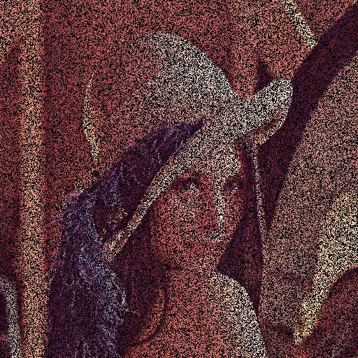
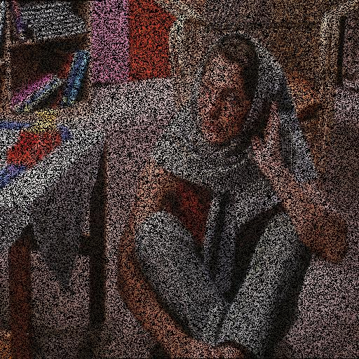
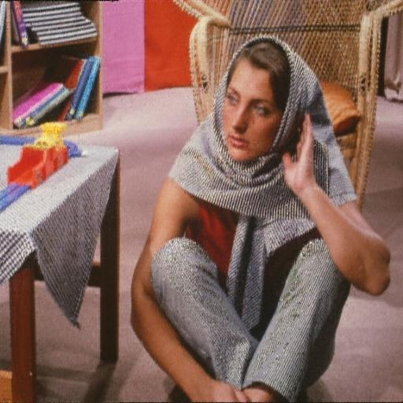
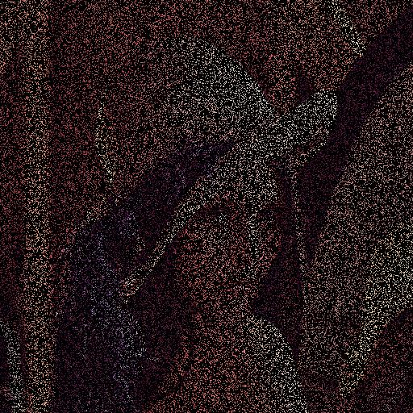
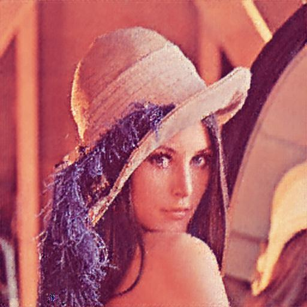
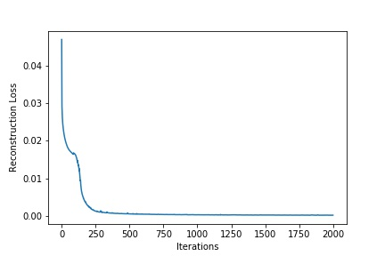
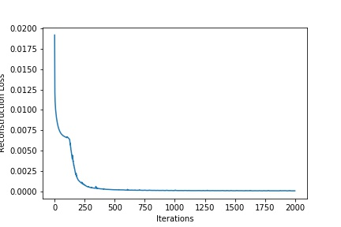

# Deep Image Prior

PyTorch implementation of the CVPR 2018 paper [Deep Image Prior](https://dmitryulyanov.github.io/deep_image_prior) by Dmitry Ulyanov et. al.  
This project is done as a part of course **GNR 638: Deep Learning for Image Analysis** at IITB. The team members are:

- Parth Shettiwar
- Sumrit Gupta

We use the method described in the paper for image inpainting. We randomly delete some pixels of a 512*512 RGB image and then try to fill them using the said technique.

## Results

### 50% pixels removed

    
    
    
    
    
    

The images used are the standard **Lena** and **Barbara** test images. The input and resultant images are as shown.The progress in the initial iterations is shown on the rightmost column.

### 80% pixels removed

    
    
    

## Training
This are the loss curves we obtained during the training on 50% and 80% images respectively. We can observe that the reconstruction loss decreases to negligible value within very few iterations.

    
    

## References
1. **Dmitry Ulyanov et. al** *Deep Image Prior* [[arxiv](https://arxiv.org/abs/1711.10925)]
2. Test Images [Public-Domain Test Images for Homeworks and Projects](https://homepages.cae.wisc.edu/~ece533/images/)
